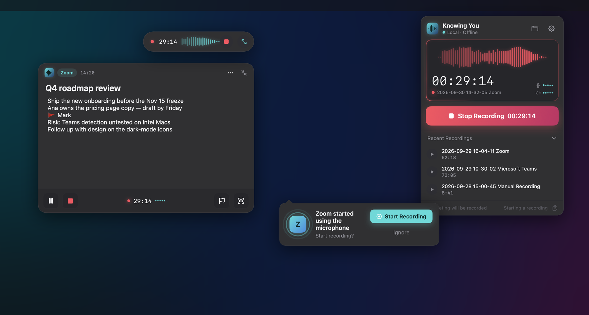
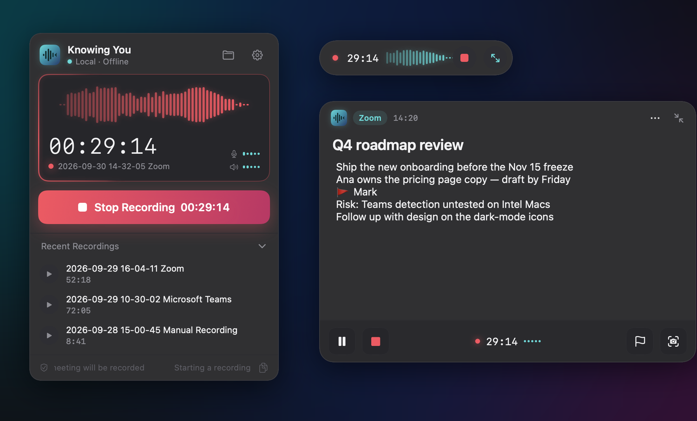
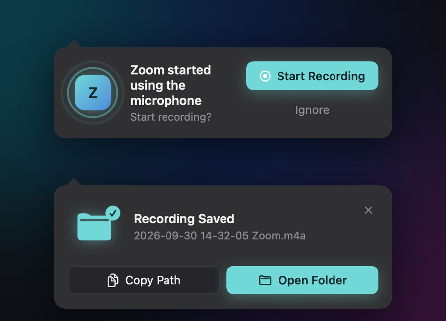
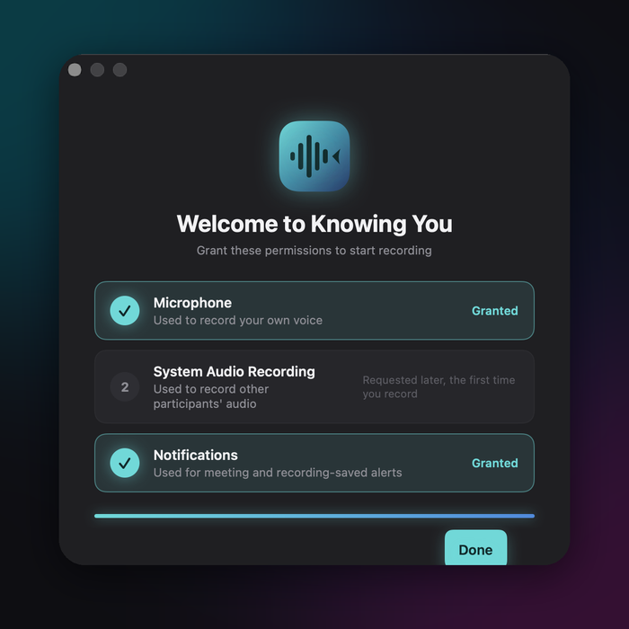
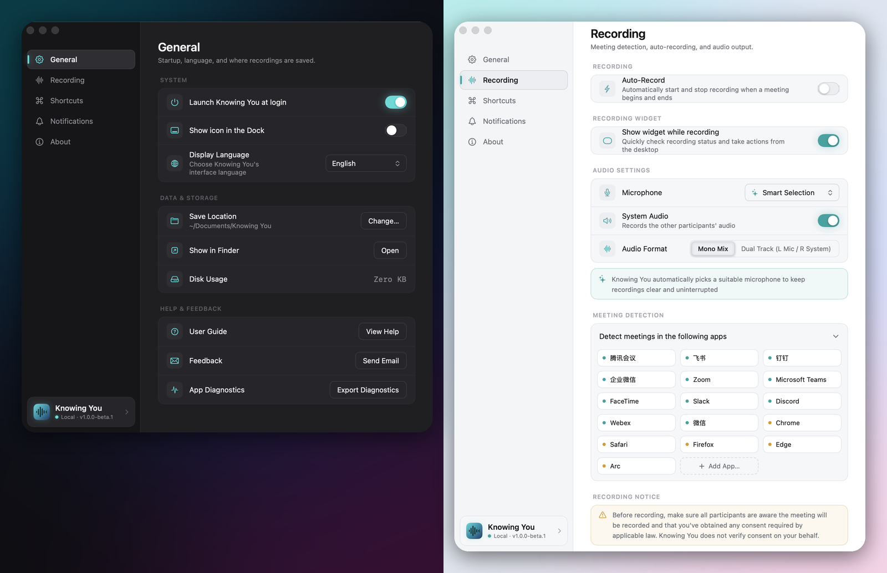

# Knowing You · 知鱼录音

**English** · [简体中文](README.zh-CN.md)

**A macOS menu-bar meeting recorder that never touches the network.** Knowing You notices when a meeting app starts using your microphone, records **both sides of the call** (your mic + the system audio), lets you jot **timestamped notes** in a small floating window while you talk, and leaves you with two plain files in a folder you choose: an `.m4a` recording and a matching `.md` notes file.

No account. No cloud. No telemetry. No auto-update. No AI.

> [!IMPORTANT]
> **Installing the beta — one extra step.** This beta isn't notarized by Apple yet, so macOS will refuse to open it ("KnowingYou" Not Opened). After dragging the app into Applications, open **Terminal** and run:
>
> ```sh
> xattr -dr com.apple.quarantine /Applications/KnowingYou.app
> ```
>
> Then open KnowingYou normally. You only need to do this once. If the "Not Opened" dialog already appeared, click **Done** — not *Move to Trash*. This is a temporary workaround until notarized builds ship. [Full install steps ↓](#download--install)



## What it does

1. **Detects the meeting.** When a known meeting app (Zoom, Microsoft Teams, FaceTime, Slack, Discord, Webex, Tencent Meeting, Feishu/Lark, DingTalk, WeCom, WeChat…) starts using the microphone, Knowing You either starts recording automatically or asks you first. Browser-based meetings (Chrome, Safari, Edge, Firefox, Arc) always ask, never auto-record, since it can't tell which website is using the mic. Each meeting prompts at most once.
2. **Records both sides.** Your microphone and everything the Mac plays (the other participants) are captured and mixed into one track, or kept as a dual-track file (left = you, right = them) if you prefer.
3. **Lets you take notes as you go.** A small capsule floats above your meeting with a live waveform and timer. Expand it into a notes window: every line you type is stamped with the wall-clock time and the offset from the start of the recording. Drop a 🚩 mark or a screenshot of the meeting window with one click or a global hotkey.
4. **Stops when the meeting ends** (the app stops using the mic for about 1 second), or whenever you press stop, and saves everything locally.



Prompts stay on screen until you act on them. They don't disappear like system notifications do:



## What you get

A flat folder of recordings, one pair of files per meeting, named by start time and app:

```
~/Documents/Knowing You/
├── 2026-09-23 14-30-12 Zoom.m4a
├── 2026-09-23 14-30-12 Zoom.md
└── 2026-09-23 14-30-12 Zoom/          ← only if you took screenshot marks
    └── 截图 14-45-30.png
```

The notes file is Markdown with YAML front matter, so it opens nicely in Obsidian, Typora, VS Code or any text editor:

```markdown
---
title: Vendor overlap review
started_at: 2026-09-23T14:30:12+08:00
ended_at: 2026-09-23T15:17:24+08:00
duration: 00:47:12
source_app: Zoom
audio: 2026-09-23 14-30-12 Zoom.m4a
paused: []
---

# Vendor overlap review

## 14:32:05 · +00:01:53
379 overlapping SKUs need an owner before next week…

## 14:40:11 · +00:09:59 · [标记]

## 14:45:30 · +00:15:18 · [截图]
![[2026-09-23 14-30-12 Zoom/截图 14-45-30.png]]
```

(The `[标记]` / `[截图]` markers — "mark" / "screenshot" — are part of the file format and stay the same whatever the UI language, so switching languages never changes existing files.)

## Zero network, verifiably

Privacy isn't a setting here, it's the architecture. The app doesn't link any networking API at all, and `scripts/check-no-network.sh` fails the build if one ever appears. Recordings and notes are written only to the folder you pick. There is no account and no usage or crash reporting. "Export Diagnostics" in Settings only produces a zip for *you* to look at. You can confirm all of this yourself with a tool like Little Snitch.

Before a recording starts, Knowing You reminds you that everyone in the meeting should know they're being recorded. Whether you need their consent depends on the law where you are.

## Download & install

> **Requirements:** macOS 14.4 or later, Apple Silicon (arm64). There's no Intel build yet.

1. Download the latest `KnowingYou-x.y.z-arm64.dmg` from [Releases](https://github.com/leweii/knowingyou-voice-record/releases).
2. Open the DMG and drag **KnowingYou** into **Applications**. Launch it from there, not from inside the DMG, or "launch at login" can't register.
3. **Remove the download quarantine flag** (temporary, needed until builds are notarized). Open **Terminal** and run:
   ```sh
   xattr -dr com.apple.quarantine /Applications/KnowingYou.app
   ```
   Without this, macOS shows "KnowingYou" Not Opened. If you already saw that dialog, click **Done** (not *Move to Trash*) and run the command.
   <details><summary>Prefer not to use Terminal?</summary>

   Try to open the app once so macOS blocks it, then go to **System Settings → Privacy & Security**, scroll down and click **Open Anyway** next to KnowingYou (the button only shows for about an hour after the block).
   </details>
4. Open **KnowingYou** from Applications and walk through the short first-run checklist. The app lives in the **menu bar** (top-right) — there's no Dock icon.



### Permissions

Each one is requested only when first needed, never all at once:

| Permission | When | Why |
|---|---|---|
| Microphone | First recording | Record your own voice |
| System audio recording | First recording | Record the other participants |
| Notifications | First-run checklist | "Meeting ended" notices |
| Screen recording | First screenshot mark | Capture the meeting window into your notes |

No Accessibility permission is needed: the global hotkeys use the system's Carbon hotkey API, which doesn't read your keystrokes.

## Using it

Knowing You lives in the menu bar: **left-click** the icon for the recording popover, **right-click** for Settings and Quit.

| Global hotkey (customizable) | Action |
|---|---|
| ⌥⌘R | Start / stop recording |
| ⌥⌘M | Mark this moment |
| ⌥⌘S | Screenshot mark of the meeting window |

In **Settings** you can turn auto-recording on or off, pick the microphone (or let it choose automatically), choose mono mix vs. dual track, change the save folder, add your own meeting apps, customize hotkeys, and switch between English and Chinese. The app follows your system's light/dark appearance.



## Build from source

You need Xcode (with the macOS 14.4+ SDK) and [XcodeGen](https://github.com/yonaskolb/XcodeGen):

```sh
brew install xcodegen
git clone https://github.com/leweii/knowingyou-voice-record.git
cd knowingyou-voice-record
make run        # generate the project, build Debug, launch
```

```sh
make build      # generate + build (includes the zero-network check)
make test       # generate + unit tests (includes the localization check)
make clean      # remove build output and the generated .xcodeproj
```

Debug builds are ad-hoc signed, so no Apple Developer account is needed to run locally. `make release` (sign → notarize → DMG → tag) needs a Developer ID Application certificate. See [docs/specs/S21-release.md](docs/specs/S21-release.md) and [docs/testing/release-checklist.md](docs/testing/release-checklist.md).

## Project docs

| File | What's in it |
|---|---|
| [CLAUDE.md](CLAUDE.md) | Architecture overview, hard-won gotchas, dev commands |
| [docs/design/ui-prototype.html](docs/design/ui-prototype.html) | Interactive design prototype: every screen and animation (open in a browser) |
| [docs/01-implementation-plan.md](docs/01-implementation-plan.md) | Tech choices, architecture, key approaches, risks, decisions |
| [docs/specs/](docs/specs/README.md) | Development specs S00–S22 with status, dependencies and decision records |
| [docs/testing/](docs/testing) | Edge-case test matrix, known issues, release checklist |

## Status

**Beta (v1.0.0-beta.3).** All core features are built and unit-tested, but real-world coverage is still thin: long-recording sync, and detection across every meeting app on many different Macs, haven't been validated widely yet. Please report problems in [Issues](https://github.com/leweii/knowingyou-voice-record/issues), or use **Settings → General → Feedback** (attach an exported diagnostics zip if you can).
