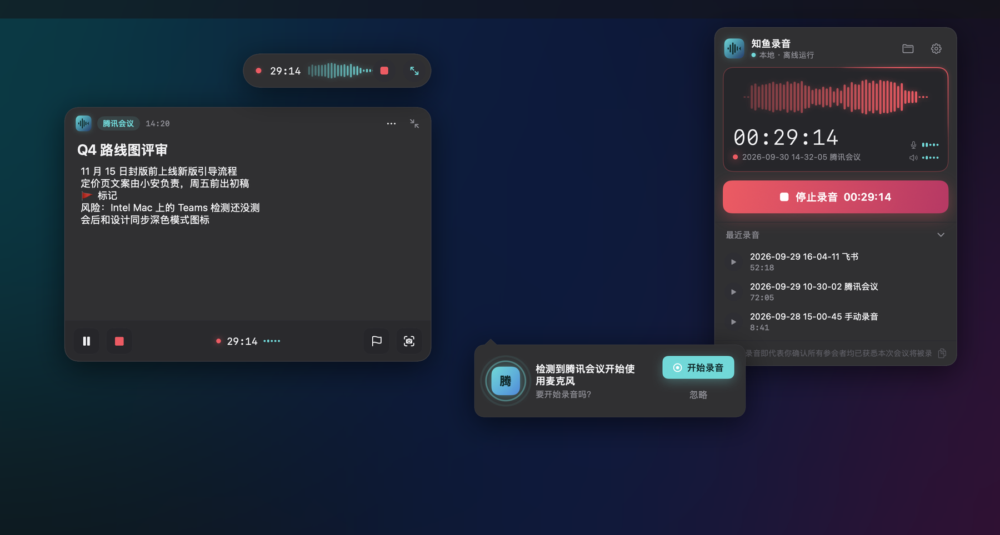
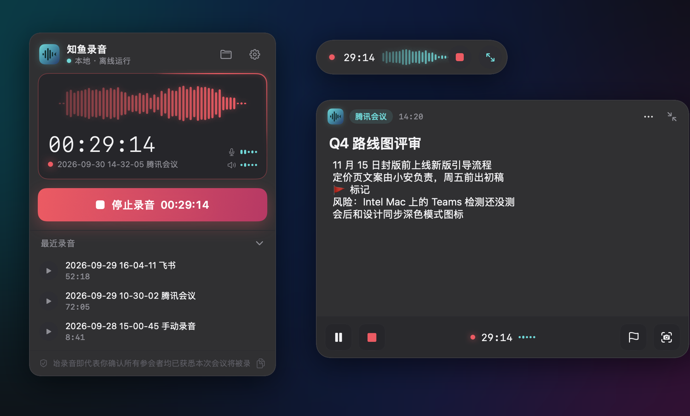
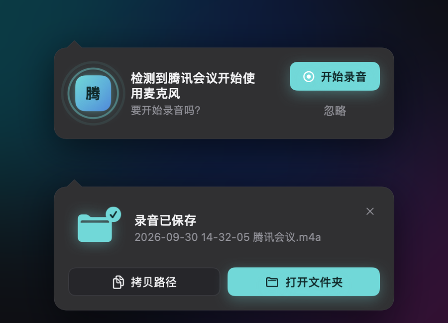
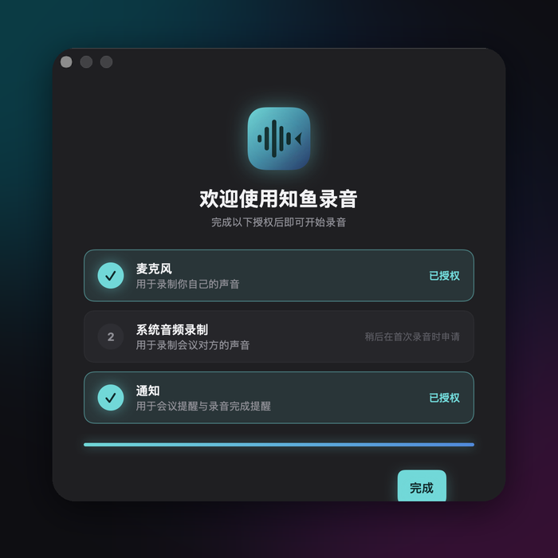
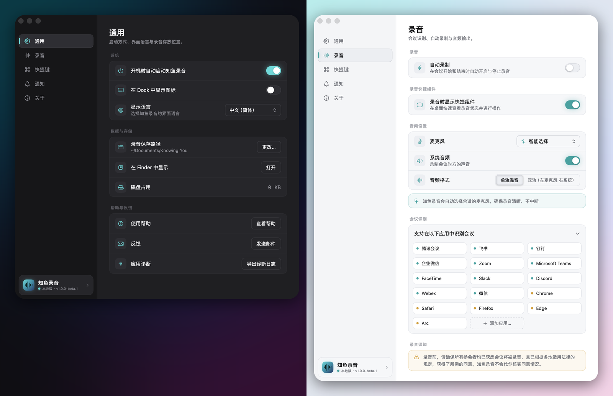

# 知鱼录音 · Knowing You

[English](README.md) · **简体中文**

**一个完全不联网的 macOS 菜单栏会议录音工具。** 知鱼录音会在会议软件开始使用麦克风时察觉到会议，**同时录下双方的声音**（你的麦克风 + 系统音频），录音时你可以在一个小浮窗里随手记下**带时间戳的纪要**，最后在你自己选的文件夹里留下两个普通文件：一个 `.m4a` 录音，一个同名的 `.md` 纪要。

没有账号，没有云端，没有遥测，没有自动更新，没有 AI。

> [!IMPORTANT]
> **安装 Beta 版需要多做一步。** 这个 Beta 还没有经过 Apple 公证，macOS 会拒绝打开（提示 "KnowingYou" Not Opened / 无法打开）。把 app 拖进「应用程序」后，打开**终端**执行：
>
> ```sh
> xattr -dr com.apple.quarantine /Applications/KnowingYou.app
> ```
>
> 然后正常打开 KnowingYou 即可，只需要做一次。如果已经弹出了拦截提示，点 **Done（完成）**，**不要**点 *Move to Trash（移到废纸篓）*。这是公证版发布之前的临时解决方案。[完整安装步骤 ↓](#下载与安装)



## 它做什么

1. **察觉会议。** 已知的会议软件（腾讯会议、飞书、钉钉、企业微信、Zoom、Microsoft Teams、FaceTime、Slack、Discord、Webex、微信……）一开始用麦克风，知鱼录音就会自动开录，或者先问你一句。浏览器里的会议（Chrome、Safari、Edge、Firefox、Arc）只提示、不自动录，因为它分辨不出是哪个网页在用麦克风。同一场会议最多只提示一次。
2. **双方都录下来。** 你的麦克风和电脑播放出来的声音（也就是其他参会者）会一起录下，默认混成单轨，也可以选双轨（左声道是你，右声道是对方）。
3. **边开会边记。** 一个小胶囊浮在会议窗口上方，显示实时波形和计时。展开就是纪要窗：你打的每一行都会自动记下挂钟时间和距录音开始的偏移。点一下或按全局快捷键，就能打一个 🚩 标记，或者截一张会议窗口的图。
4. **会议结束自动停止**（会议软件停止使用麦克风约 1 秒后），你也可以随时手动停止。所有内容只保存在本地。



提醒卡片会一直停在屏幕上，直到你处理为止，不会像系统通知那样一闪而过：



## 你会得到什么

一个平铺的录音文件夹，每场会议一对文件，按开始时间和会议软件命名：

```
~/Documents/知鱼录音/
├── 2026-09-23 14-30-12 腾讯会议.m4a
├── 2026-09-23 14-30-12 腾讯会议.md
└── 2026-09-23 14-30-12 腾讯会议/      ← 仅在有截图标记时出现
    └── 截图 14-45-30.png
```

纪要是带 YAML 头信息的 Markdown，在 Obsidian、Typora、VS Code 或任何文本编辑器里都能直接打开：

```markdown
---
title: 供应商重叠问题讨论
started_at: 2026-09-23T14:30:12+08:00
ended_at: 2026-09-23T15:17:24+08:00
duration: 00:47:12
source_app: 腾讯会议
audio: 2026-09-23 14-30-12 腾讯会议.m4a
paused: []
---

# 供应商重叠问题讨论

## 14:32:05 · +00:01:53
供应商重叠的 379 组 SKU 需要在下周前确认归属……

## 14:40:11 · +00:09:59 · [标记]

## 14:45:30 · +00:15:18 · [截图]
![[2026-09-23 14-30-12 腾讯会议/截图 14-45-30.png]]

## 15:02:47 · +00:32:35
Action：Jay 下周三前给出 42* 与 5* 合并方案
```

## 零联网，而且可以验证

隐私在这里不是一个开关，而是架构本身。app 完全不链接任何联网 API，`scripts/check-no-network.sh` 会在构建时拦下任何出现的联网代码。录音和纪要只写进你选的文件夹。没有账号体系，不收集任何使用数据或崩溃日志。设置里的「导出诊断日志」只会生成一个 zip 给**你自己**查看。你可以用 Little Snitch 之类的工具亲自验证这一切。

开始录音前，知鱼录音会提醒你确认所有参会者都已知悉会议将被录音。具体是否需要取得对方同意，请遵守你所在地区的法律法规。

## 下载与安装

> **系统要求：** macOS 14.4 或更新，Apple Silicon（arm64）。暂无 Intel 版本。

1. 前往 [Releases](https://github.com/leweii/knowingyou-voice-record/releases) 下载最新的 `KnowingYou-x.y.z-arm64.dmg`。
2. 打开 DMG，把 **KnowingYou** 拖进「应用程序」文件夹，再从「应用程序」里打开。直接从 DMG 里运行的话，「开机启动」无法注册。
3. **去掉下载隔离标记**（临时方案，公证版发布前需要）。打开**终端**执行：
   ```sh
   xattr -dr com.apple.quarantine /Applications/KnowingYou.app
   ```
   不做这一步，macOS 会提示 "KnowingYou" Not Opened。如果已经看到这个提示，点 **Done（完成）**（不要点 *Move to Trash*），再执行上面的命令。
   <details><summary>不想用终端？</summary>

   先尝试打开一次 app 让系统拦截，然后打开「系统设置 → 隐私与安全性」，滚到底部，在 KnowingYou 旁边点「仍要打开」（这个按钮只在被拦截后约一小时内出现）。
   </details>
4. 从「应用程序」里打开 **KnowingYou**，按首次启动的引导完成授权。app 常驻在屏幕右上角的**菜单栏**里，没有 Dock 图标。



### 权限

每项权限都在第一次用到时才申请，不会一次性弹一堆：

| 权限 | 什么时候申请 | 用途 |
|---|---|---|
| 麦克风 | 第一次录音时 | 录下你自己的声音 |
| 系统音频录制 | 第一次录音时 | 录下其他参会者的声音 |
| 通知 | 首次启动引导 | 「会议已结束」提醒 |
| 屏幕录制 | 第一次截图标记时 | 把会议窗口截图放进纪要 |

不需要辅助功能（Accessibility）权限：全局快捷键用的是系统的 Carbon 热键 API，不会读取你的按键。

## 使用

知鱼录音常驻在菜单栏：**左键**点图标打开录音弹窗，**右键**打开偏好设置和退出菜单。

| 全局快捷键（可自定义） | 功能 |
|---|---|
| ⌥⌘R | 开始 / 停止录音 |
| ⌥⌘M | 标记当前时刻 |
| ⌥⌘S | 截取会议窗口作为截图标记 |

在**偏好设置**里可以：开关自动录制，选麦克风（或交给它智能选择），选单轨混音或双轨，修改保存位置，添加你自己的会议软件，自定义快捷键，在中文和英文之间切换。界面会跟随系统的浅色 / 深色外观。



## 从源码构建

需要 Xcode（含 macOS 14.4+ SDK）和 [XcodeGen](https://github.com/yonaskolb/XcodeGen)：

```sh
brew install xcodegen
git clone https://github.com/leweii/knowingyou-voice-record.git
cd knowingyou-voice-record
make run        # 生成工程、构建 Debug 版本、打开
```

```sh
make build      # 生成工程 + 构建（含零联网静态检查）
make test       # 生成工程 + 跑单元测试（含本地化完整性检查）
make clean      # 清理构建产物和生成的 .xcodeproj
```

Debug 构建用 ad-hoc 签名，本地运行不需要 Apple Developer 账号。`make release`（签名 → 公证 → DMG → 打 tag）需要 Developer ID Application 证书，见 [docs/specs/S21-release.md](docs/specs/S21-release.md) 和 [docs/testing/release-checklist.md](docs/testing/release-checklist.md)。

## 项目文档

| 文件 | 内容 |
|---|---|
| [CLAUDE.md](CLAUDE.md) | 架构总览、踩过的坑、开发命令 |
| [docs/design/ui-prototype.html](docs/design/ui-prototype.html) | 可交互的设计原型：所有界面与动效（用浏览器打开） |
| [docs/01-implementation-plan.md](docs/01-implementation-plan.md) | 技术选型、架构、关键方案、风险、已确认决策 |
| [docs/specs/](docs/specs/README.md) | 开发 spec S00–S22：状态表、依赖图、每个 spec 的决策记录 |
| [docs/testing/](docs/testing) | 边界情况测试矩阵、已知问题、发布检查清单 |

## 状态

**Beta（v1.0.0-beta.4）。** 全部核心功能已完成并通过单元测试，但真实环境覆盖还不够：长时间录音的混音同步，以及各会议软件在不同机器上的检测，都还没有经过大范围验证。遇到问题欢迎在 [Issues](https://github.com/leweii/knowingyou-voice-record/issues) 反馈，或者用 app 内的「设置 → 通用 → 反馈」发邮件（最好附上导出的诊断日志）。
