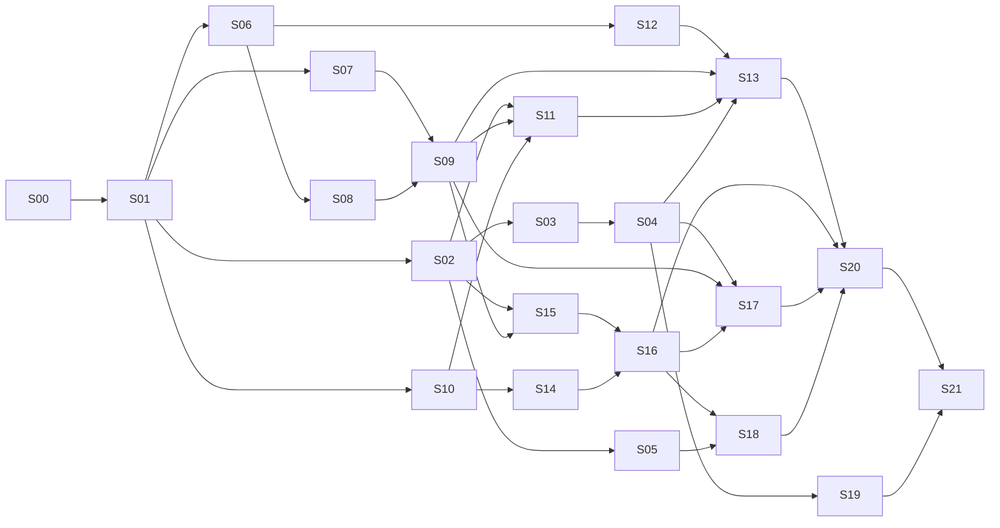

# 开发 Spec 索引与工作流

> 本目录把 `../01-implementation-plan.md` 的 M0–M5 六个里程碑拆成 22 个可独立领取、独立验收的 spec。每个 spec 是一次 1–3 人日的开发任务，写清楚做什么、不做什么、依赖谁、怎么算完成。给人和 Claude Code 共同使用。

## 1. 工作流

1. **选任务**：在 §3 状态表里选一个 `todo` 且所有依赖已 `done` 的 spec。优先级按 ID 顺序，但同一里程碑内可并行（见 §4 依赖图）。
2. **开工**：把该 spec 文件 frontmatter 的 `status` 改为 `in-progress`，同步 §3 表格。一次只做一个 spec。
3. **实现**：只做 spec 的"范围 › 做"里列的事。遇到 spec 没写清的问题，先查 `01-implementation-plan.md` 与 `02-ui-spec.md`；仍无答案时自行决定，并把决定写进该 spec 的"决策记录"一节，不要只留在代码注释或对话里。
4. **完成定义（DoD）**，全部满足才能改 `done`：
   - "验收标准"每一条都逐项核对通过，手工项写明在哪台机器 / 哪个系统版本验证的；
   - 有单元测试要求的项测试通过；`make test` 全绿；
   - `make build` 零 warning（Swift 6 strict concurrency 下）；
   - `scripts/check-no-network.sh` 通过（S01 之后生效）；
   - spec 里的"交付物"文件都存在；`CLAUDE.md` 若受影响已更新（例如新增命令、新增模块）。
5. **提交**：commit message 以 spec ID 开头，如 `S07: MicCapture 设备切换恢复`。一个 spec 可多次 commit。
6. **范围变化**：发现 spec 需要拆分、合并或改范围，直接改 spec 文件并在决策记录里写原因；新拆出的 spec 用 `S22+` 编号并登记到 §3。
7. **不要跳过 S06 spike**：M1 / M2 的音频与检测 API 无正式文档，S06 的结论会反写进 S08 / S12 / S13。
8. **UI spec 的视觉验证方式**（S03 踩出来的经验）：这个开发环境能实际 `open` 编译好的 app、`screencapture` 截图、用临时 `#if DEBUG` 环境变量钩子跳过点击直接打开某个窗口——这些是安全的，做完记得把临时钩子改回去。但**不要用 `CGEvent`/坐标盲点合成鼠标点击**去做交互测试：这台机器是用户在实时使用的真实桌面，我的测试窗口和用户自己的窗口（Slack、System Settings 等）会抢焦点，按预算坐标点击有点到用户真实界面的风险。所以"开关点了之后状态对不对""点按钮之后 Finder/邮件/面板弹没弹出来"这类需要真人点一下的验收项，目前只能：① 代码走查 + 单元测试覆盖点击之外的逻辑，② 标注为待验证，交给 Jakob 在自己方便的时候用 `make run` 肉眼点一遍。同理，`NSStatusItem`（菜单栏图标）在这台机器上实测会被定位到屏幕可见区域之外（多屏 + 远程桌面的某种怪癖，见 S03 决策记录），所以"菜单栏图标真的可见"这条也进不了自动化验证范围，S21 发布前必须找一台非远程操作的真实 Mac 确认一次。
9. **TCC 权限（麦克风/系统音频/屏幕录制）在这台机器上无法真实验证，且比"不方便点"更根本**（S07 踩出来的经验）：实测触发麦克风权限弹窗时，标题是 **"Air" 想访问麦克风**，不是 "KnowingYou"——这台开发环境里跑的调试二进制，TCC 身份判定跟到了宿主 agent 进程头上。也就是说这不只是"没人点弹窗"的问题：就算点了"允许"，被授权的也是宿主环境，不是 KnowingYou.app，测的是错的东西。所以 S07/S08/S09（以及任何用到麦克风、系统音频 tap、屏幕录制的功能）在这台机器上只能做到编译通过 + 纯逻辑单测 + 代码走查，**真实硬件权限链路必须交给 Jakob 在他自己正常签名安装的 Mac 上跑一遍**，不要在这台机器上假装验证过。另外试过用 `CGEvent` 关掉残留的权限弹窗，TCC 弹窗对合成输入有防护、不会被关掉——这是苹果的安全设计，别浪费时间再试。

## 2. 已确认决策（2026-09-23 Jakob 拍板，对应 `01-implementation-plan.md` §12）

| # | 决策 | 默认值 | 影响 spec |
|---|---|---|---|
| 1 | 最低系统 | macOS 14.4 | S01 |
| 2 | 默认音频格式 | 单轨混音 m4a 96 kbps；双轨为可选项 | S04, S09 |
| 3 | 文件命名 | `YYYY-MM-DD HH-mm-ss 应用名` 平铺；无应用触发用"手动录音"；纪要标题不改文件名 | S10, S14 |
| 4 | 关于页外链 | 保留"检查更新"（GitHub Releases）+ 1 个 GitHub 图标，均用系统浏览器打开 | S04, S19 |
| 5 | 帮助与反馈三行 | 使用帮助（本地 md）/ 反馈（mailto，**邮箱待填**，先用占位常量 `KYFeedbackEmail`）/ 导出诊断日志 | S03, S19 |
| 6 | 左栏底部卡片 | App 图标 + 知鱼录音 + 金色"本地版 · v1.0.0"，点击跳关于 | S03 |
| 7 | 通知页 2、3 行 | 会议结束提醒 / 录音已保存提醒 | S04, S13 |
| 8 | 本地转写 | 不进 v1 | — |
| 9 | CPU 架构 | v1 只出 arm64（减少测试矩阵；Intel 待需求） | S01, S21 |
| 10 | Bundle ID | `com.jakobhe.knowingyou` | S01 |
| 11 | Logo | 未就位前全部用 SF Symbol `waveform.circle` 占位，集中在 `DesignSystem/Brand.swift` 一处替换 | S02 |

这些不再是"待确认"，是已拍板的执行依据；除非 Jakob 明确推翻，不要在实现时重新讨论。仍是占位、**发布前必须替换**的两项：#5 反馈邮箱（S19 检查，S21 release 前置校验拦截）、#11 Logo（S21 发布检查清单一项）。其余假设若后续要推翻：改这张表，再改受影响 spec，并在该 spec 的"决策记录"里注明变更日期与原因。

## 3. 状态表

状态取值：`todo` / `in-progress` / `blocked` / `done`。估时为人日（含 AI 辅助）。

| ID | 名称 | 里程碑 | 依赖 | 估时 | 状态 |
|---|---|---|---|---|---|
| [S00](S00-shared-contracts.md) | 共享类型与契约 | — | — | 0.5 | done |
| [S01](S01-project-scaffold.md) | Xcode 工程脚手架与构建命令 | M0 | S00 | 1.5 | done |
| [S02](S02-design-system.md) | DesignSystem 控件库 | M0 | S01 | 2 | done |
| [S03](S03-settings-shell-general.md) | 设置窗口框架 + 通用页 | M0 | S02 | 1.5 | done |
| [S04](S04-settings-other-pages.md) | 录音 / 快捷键 / 通知 / 关于 四页静态还原 | M0 | S03 | 2 | done |
| [S05](S05-permissions-onboarding.md) | 权限模块 + 首次启动引导 | M0 | S02 | 1 | done |
| [S06](S06-spike-process-tap.md) | Spike：Process Tap + 麦克风占用检测验证 | M1 | S01 | 2 | done |
| [S07](S07-mic-capture.md) | MicCapture + 电平计算 | M1 | S01 | 1 | done |
| [S08](S08-system-audio-tap.md) | SystemAudioTap | M1 | S06 | 2 | done |
| [S09](S09-recording-session.md) | RecordingSession：混音、CAF 写入、m4a 转码、暂停 | M1 | S07, S08 | 2 | done |
| [S10](S10-recording-store-naming.md) | RecordingStore + 文件命名 + 崩溃恢复 | M1 | S01 | 1 | done |
| [S11](S11-statusbar-popover.md) | 菜单栏图标 + 弹窗 | M1 | S02, S09, S10 | 2 | done |
| [S12](S12-meeting-detector.md) | MeetingDetector + KnownApps | M2 | S06 | 2.5 | done |
| [S13](S13-meeting-coordinator-notifications.md) | MeetingCoordinator 状态机 + 通知 + 自动录制 | M2 | S12, S09, S11, S04 | 3.5 | done |
| [S14](S14-notes-store-markdown.md) | NotesStore + 纪要 Markdown 序列化 | M3 | S10 | 1.5 | done |
| [S15](S15-floating-widget-pill.md) | 浮窗药丸态 | M3 | S02, S09 | 1.5 | done |
| [S16](S16-floating-widget-notes.md) | 浮窗纪要窗态 + 尺寸动画 | M3 | S15, S14 | 3 | done |
| [S17](S17-hotkeys.md) | HotkeyManager + 快捷键页交互 | M4 | S04, S09, S16 | 1.5 | done |
| [S18](S18-screenshot-marker.md) | 截屏标记 | M4 | S16, S05 | 1 | todo |
| [S19](S19-docs-diagnostics-l10n.md) | 帮助 / 协议 / 隐私文档、诊断导出、本地化补全 | M4 | S04 | 1.5 | todo |
| [S20](S20-edge-cases-test-matrix.md) | 边界情况 + 手工测试矩阵 | M4 | S13, S16, S17, S18 | 2 | todo |
| [S21](S21-release.md) | 签名、公证、DMG、发布检查 | M5 | S20, S19 | 2.5 | todo |

合计约 38.5 人日，与计划 7.5 周一致。

## 4. 依赖图与并行轨道

S01 完成后有三条可并行的轨道：

- **UI 轨**：S02 → S03 → S04 → S05
- **音频轨**：S06 → S08；S07；然后 S09
- **存储轨**：S10 → S14

三条轨道在 S11（弹窗）汇合，之后 S12/S13（会议识别）与 S15/S16（浮窗）又可并行。

## 5. 里程碑验收（来自计划 §9，spec 全部 done 后再整体核对一次）

| 里程碑 | 包含 spec | 整体验收 |
|---|---|---|
| M0 | S01–S05 | 五个设置页与截图逐像素对比无明显偏差；所有开关可改并持久化 |
| M1 | S06–S11 | 从弹窗开录一段腾讯会议，双方声音都在，文件名为 `时间戳 腾讯会议.m4a`；kill -9 后重启能恢复 |
| M2 | S12–S13 | 打开 Zoom 入会 → 3 秒内收到通知 / 自动开录；退会 10 秒后自动停并通知 |
| M3 | S14–S16 | 录音中边记边看，停止后 `.md` 时间戳与偏移正确、与 m4a 同名 |
| M4 | S17–S20 | 手工测试矩阵：6 个会议软件 × 内置/USB/蓝牙麦 × 14.4/15/26 |
| M5 | S21 | 干净 Mac 从 DMG 安装跑通全流程；Little Snitch 确认零网络连接 |
